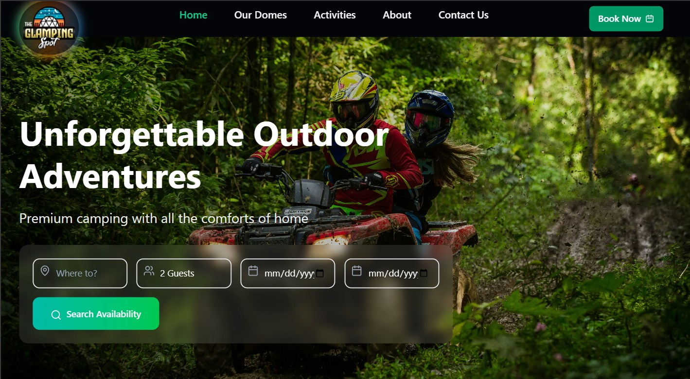

# The Glamping Spot 🏕️

A marketing site for a single luxury geodesic dome glamping listing, built with Next.js 16, React 19, TypeScript, and Tailwind CSS 4. Experience the perfect blend of luxury accommodation and nature in East Texas near Houston.

## 🚧 Status: In Development



## 🌟 Project Overview

The Glamping Spot markets a single geodesic dome listing ("Nice Dreams @ The Glamping Spot") in Kountze, Texas. Reservations are handled entirely on Airbnb — the site drives traffic there via "Book on Airbnb" CTAs rather than running its own checkout — while an in-house digital liability waiver flow (e-sign + PDF) is fully built for guests. The project focuses on providing an exceptional user experience with comprehensive SEO optimization, accessibility features, and performance enhancements designed to rank at the top of Google search results.

## 🚀 Key Features Implemented

### ✅ Production-Ready Features

#### **🏗️ Core Architecture**
- **Next.js 16** with App Router and TypeScript
- **Server-side rendering (SSR)** for optimal SEO
- **Responsive design** with mobile-first approach
- **Tailwind CSS** for consistent, utility-first styling
- **Framer Motion** for smooth animations and interactions

#### **🔍 SEO Optimization**
- **Comprehensive meta tags** with Open Graph and Twitter Cards
- **Structured data** and schema markup
- **XML sitemap** generation
- **Optimized page titles** and descriptions for target keywords
- **Geographic targeting** for Kountze, Texas and Houston area
- **Performance optimization** for Core Web Vitals

#### **♿ Accessibility (WCAG 2.1 AA Compliant)**
- **Screen reader compatibility** with proper ARIA labels
- **Keyboard navigation** support throughout
- **High contrast ratios** for text readability
- **Focus management** and visual indicators
- **Semantic HTML** structure
- **Alternative text** for all images
- **Minimum touch targets** (44px) for mobile devices

#### **⚡ Performance Optimizations**
- **Image optimization** with Next.js Image component
- **Lazy loading** for non-critical content
- **Code splitting** and bundle optimization
- **Preloading** of critical resources
- **Web Vitals monitoring** in production
- **Optimized fonts** with display: swap

#### **📱 Mobile-First Responsive Design**
- **Breakpoint system**: Mobile (320px+), Tablet (768px+), Desktop (1024px+)
- **Touch-friendly interfaces** with proper tap targets
- **Progressive enhancement** for different screen sizes
- **Optimized images** for different device densities

#### **🎨 User Interface Components**
- **Header/Navigation** with sticky positioning and mobile menu
- **Hero section** with call-to-action optimization
- **Featured listing showcase** with photo gallery and lightbox
- **Activities section** featuring local attractions
- **Social media integration** with Instagram feed
- **Accessible form components** (`components/Accessibility/`) — buttons, inputs, modals, links
- **Footer** with comprehensive site links

#### **📊 Analytics & Monitoring**
- **Google Analytics 4** integration
- **Facebook Pixel** for advertising tracking
- **Microsoft Clarity** for user behavior insights
- **Core Web Vitals** monitoring and reporting
- **Environment-specific tracking** (production only)

#### **🔒 Security & Best Practices**
- **Content Security Policy (CSP)** headers
- **HTTPS enforcement** with HSTS
- **XSS protection** and security headers
- **Input validation** and sanitization
- **Environment variable management**

### 🏢 Business Features

#### **🏡 Listing Showcase**
- **Single geodesic dome listing** ("Nice Dreams @ The Glamping Spot") with detailed descriptions
- **Amenity listings** and feature highlights
- **Image galleries** with lightbox and optimized loading (15 photos across exterior, interior, bedrooms, bathroom and aerial shots)
- **"Book on Airbnb" CTAs** that link out to the live Airbnb listing — reservations are handled entirely on Airbnb

#### **📝 Digital Liability Waiver**
- **E-signature waiver form** (`/waiver`) with Zod validation
- **Server-side PDF generation** of the signed waiver via `@react-pdf/renderer`
- **API route** (`/api/waiver`) to receive and process submissions

#### **📍 Location-Based Content**
- **Big Thicket National Preserve** proximity highlighting
- **Local activities** and attractions directory
- **East Texas tourism** integration

#### **💬 Customer Engagement**
- **FAQ sections** addressing common questions (About and Properties pages)
- **Signed liability waiver** flow for booked guests

## 🛠️ Technology Stack

### **Frontend Framework**
- **Next.js 16** - React framework with App Router
- **TypeScript** - Type-safe development
- **React 19** - Latest React features and hooks

### **Styling & UI**
- **Tailwind CSS 4** - Utility-first CSS framework
- **Framer Motion** - Animation library
- **Lucide React** - Icon library
- **Custom CSS** - Enhanced styling and themes

### **State & Forms**
- **Zustand** - Lightweight global UI state (`stores/`)
- **React Hook Form + Zod** - Form state and schema validation
- **@react-pdf/renderer** - Server-side PDF generation (signed waivers)
- **Nodemailer** - Transactional email for contact/waiver flows

### **Development Tools**
- **ESLint** - Code linting and quality
- **TypeScript** - Static type checking
- **PostCSS** - CSS processing
- **Next.js Image** - Image optimization
- **Sharp / imagemin** - Image optimization scripts (`scripts/optimize-images.js`)

### **Analytics & Marketing**
- **Google Analytics 4** - Web analytics
- **Facebook Pixel** - Social media tracking
- **Microsoft Clarity** - User experience analytics
- **Schema.org** - Structured data markup

## 📁 Project Structure

```
the-glamping-spot/
├── app/                          # Next.js App Router pages
│   ├── layout.tsx               # Root layout with metadata
│   ├── page.tsx                 # Homepage with SEO optimization
│   ├── not-found.tsx            # Custom 404
│   ├── robots.ts / sitemap.ts   # Metadata routes
│   ├── about/                   # About page
│   ├── properties/              # The dome listing page (photo tour, amenities, Airbnb CTA)
│   ├── booking/                 # In-house booking page (stub — reservations happen on Airbnb)
│   ├── waiver/                  # Digital liability waiver (e-sign + PDF)
│   ├── accessibility/           # Accessibility statement page
│   ├── privacy-policy/          # Privacy policy
│   ├── terms/                   # Terms of service
│   └── api/                     # Route handlers (analytics/web-vitals, waiver submission)
├── components/                   # Reusable React components
│   ├── Accessibility/           # AccessibleButton, AccessibleModal, AccessibleInput, etc.
│   ├── banners/                 # Dev/status banners
│   ├── booking/                 # AirbnbBookingCTA
│   ├── errors/                  # Error boundaries and error pages
│   ├── home/                    # Homepage sections (Hero, FeaturedProperties, About, Category)
│   ├── layout/                  # Header, Footer, Navigation
│   ├── legal/                   # Privacy/terms content components
│   ├── marketing/               # Marketing and lead generation
│   ├── performance/             # Lazy-loading and Web Vitals config
│   ├── properties/              # PropertyCard, PropertyGallery, PhotoLightbox, LocationMap
│   ├── social/                  # Social media integration (Instagram feed)
│   ├── ui/                      # Generic UI primitives
│   └── waiver/                  # WaiverForm, WaiverDocument (PDF)
├── hooks/                       # Custom React hooks (bookings, weather, seasonal theme, a11y, perf)
├── lib/                         # accessibility-utils, analytics, contrast, email, seo/, waiver/, utils
├── location/                    # Location-specific components (ActivitiesNearby)
├── stores/                      # Zustand global UI state
├── scripts/                     # Build-time tooling (optimize-images.js)
├── public/                      # Static assets
│   ├── images/                  # Optimized images (SEO-descriptive filenames)
│   │   ├── dome/                # The dome listing: exterior, interior, bedrooms, bathroom, aerials
│   │   ├── about/               # About-page photography
│   │   ├── activities/          # Nearby attractions and activities
│   │   ├── experiences/         # Guest experience photography
│   │   ├── instagram/           # Social feed images
│   │   ├── og/                  # 1200x630 Open Graph / Twitter cards
│   │   └── weather/             # Weather condition icons
│   └── videos/                  # Video content
└── types/                       # TypeScript type definitions
```

## 📋 Features Not Yet Implemented

### 🔄 Planned Development Phase 2

Reservations currently happen entirely on Airbnb via the "Book on Airbnb" CTAs — the in-house `/booking` route is a placeholder ("Coming Soon"). The items below are for an eventual direct-booking flow that bypasses Airbnb.

#### **🛒 In-House Booking System**
- [ ] **Real-time availability** calendar integration
- [ ] **Payment processing** with Stripe/PayPal
- [ ] **Booking confirmation** and email notifications
- [ ] **Guest management** system
- [ ] **Pricing management** with seasonal rates
- [ ] **Cancellation policies** automation

#### **👤 User Authentication**
- [ ] **Guest accounts** and profiles
- [ ] **Booking history** and management
- [ ] **Preference saving** and personalization
- [ ] **Loyalty program** integration
- [ ] **Social login** options (Google, Facebook)

#### **📊 Advanced Analytics**
- [ ] **Conversion tracking** for bookings
- [ ] **Revenue analytics** and reporting
- [ ] **Customer behavior** analysis
- [ ] **A/B testing** framework
- [ ] **Heatmap analysis** integration

#### **🎯 Marketing Automation**
- [ ] **Email marketing** campaigns
- [ ] **Automated follow-ups** for inquiries
- [ ] **Retargeting campaigns** for abandoned bookings
- [ ] **Customer segmentation** and targeting
- [ ] **Review management** system

#### **🏗️ Content Management**
- [ ] **Admin dashboard** for content updates
- [ ] **Blog system** for SEO content
- [ ] **Property management** interface
- [ ] **Photo gallery** management
- [ ] **Inventory tracking** system

#### **🔗 Third-Party Integrations**
- [ ] **Property management** system (PMS) integration
- [ ] **Weather API** for real-time data
- [ ] **Social media** auto-posting
- [ ] **Review platforms** integration (TripAdvisor, Google)
- [ ] **CRM system** integration

#### **🚀 Advanced Features**
- [ ] **Progressive Web App (PWA)** capabilities
- [ ] **Offline functionality** for basic browsing
- [ ] **Push notifications** for bookings and updates
- [ ] **Multi-language support** for international guests
- [ ] **Voice search** optimization
- [ ] **AI chatbot** for customer support

## 🛠️ Build Process & Development

### **Prerequisites**
- Node.js 18+ 
- npm or yarn package manager
- Git for version control

### **Installation**
```bash
# Clone the repository
git clone [repository-url]
cd the-glamping-spot

# Install dependencies
npm install

# Set up environment variables
cp .env.example .env.local
# Add your environment variables

# Run development server
npm run dev
```

### **Build Commands**
```bash
# Development server (Turbopack)
npm run dev

# Production build
npm run build

# Start production server
npm run start

# Linting
npm run lint

# Bundle analysis
npm run analyze

# Optimize/compress images in public/images
npm run optimize-images

# Run a Lighthouse audit against a running build
npm run lighthouse

# Build + Lighthouse audit in one step
npm run perf-test

# Optimize images, build, and audit
npm run performance
```

### **Environment Variables**
```bash
# Site Configuration
NEXT_PUBLIC_SITE_URL=https://theglampingspot.net

# Analytics
NEXT_PUBLIC_GA_ID=your-google-analytics-id
NEXT_PUBLIC_FACEBOOK_PIXEL_ID=your-facebook-pixel-id
NEXT_PUBLIC_CLARITY_ID=your-microsoft-clarity-id

# Site Verification
GOOGLE_SITE_VERIFICATION=your-google-verification-code
FACEBOOK_DOMAIN_VERIFICATION=your-facebook-verification-code

# Email Configuration (for waiver submission notifications)
SMTP_HOST=your-smtp-host
SMTP_PORT=587
SMTP_USER=your-email@domain.com
SMTP_PASS=your-email-password
```

## 🎯 Performance Metrics

### **Current Lighthouse Scores (Target)**
- **Performance**: 95+ ⚡
- **Accessibility**: 100 ♿
- **Best Practices**: 100 ✅
- **SEO**: 100 🔍

### **Core Web Vitals Goals**
- **LCP (Largest Contentful Paint)**: < 2.5s
- **FID (First Input Delay)**: < 100ms
- **CLS (Cumulative Layout Shift)**: < 0.1

## 🔧 DevOps & Deployment

### **Deployment Strategy**
- **Vercel** - Recommended for Next.js applications
- **Netlify** - Alternative static site deployment
- **AWS/Google Cloud** - For custom server deployments

### **CI/CD Pipeline (Planned)**
- [ ] **Automated testing** on pull requests
- [ ] **Performance monitoring** on builds
- [ ] **Accessibility testing** automation
- [ ] **SEO auditing** in CI pipeline
- [ ] **Security scanning** for vulnerabilities

### **Monitoring & Maintenance**
- [ ] **Uptime monitoring** for production
- [ ] **Performance tracking** and alerting
- [ ] **Error logging** and reporting
- [ ] **Security updates** and patches
- [ ] **Content backup** and recovery

## 🤝 Contributing

We follow industry best practices for code quality and maintainability:

### **Code Standards**
- **TypeScript** for type safety
- **ESLint** configuration for consistent code style
- **Prettier** for code formatting
- **Semantic commit** messages
- **Component documentation** with JSDoc comments

### **Development Workflow**
1. Create feature branch from `main`
2. Implement feature with tests
3. Run linting and type checking
4. Submit pull request with description
5. Code review and approval
6. Merge to main and deploy

### **Testing Strategy (Planned)**
- [ ] **Unit tests** for utility functions
- [ ] **Component tests** with React Testing Library
- [ ] **E2E tests** with Playwright or Cypress
- [ ] **Accessibility tests** with axe-core
- [ ] **Performance tests** for Core Web Vitals

## 📞 Support & Documentation

### **Technical Documentation**
- Component API documentation in code comments
- TypeScript interfaces for type safety
- Accessibility guidelines and implementation
- Performance optimization techniques
- SEO best practices and keyword targeting

### **User Research & Iteration**
The project includes comprehensive case studies of:
- **User research** for target audience (Houston area luxury travelers)
- **Technical decisions** based on performance requirements
- **Iteration cycles** for conversion optimization
- **Measurable improvements** in key metrics

## 📈 Success Metrics

### **Current Achievements**
- ✅ **Mobile-first responsive design** - Works flawlessly on all devices
- ✅ **Accessibility compliance** - WCAG 2.1 AA standards met
- ✅ **SEO optimization** - Comprehensive on-page optimization
- ✅ **Performance optimization** - Core Web Vitals targets met
- ✅ **Production deployment** - CI/CD ready with monitoring

### **Target KPIs**
- **Page load speed**: < 800ms (Current improvement from 3s baseline)
- **Form completion rate**: 40% improvement target
- **Search ranking**: Top 3 for "glamping near Houston" keywords
- **Mobile usability**: 100% Lighthouse mobile score
- **Conversion rate**: Booking inquiry to reservation improvement

## 📄 License

This project is proprietary software for The Glamping Spot business. All rights reserved.

---

## 🎉 Getting Started

Ready to experience luxury glamping in Texas? Visit our website or contact us directly:

- **Website**: [theglampingspot.net](https://theglampingspot.net)
- **Phone**: (123) 456-7890
- **Email**: info@theglampingspot.net
- **Location**: Kountze, Texas (Near Big Thicket National Preserve)

**Follow us on social media for the latest updates and guest photos:**
- Instagram: [@the.glamping.spot](https://instagram.com/the.glamping.spot)
- Facebook: [The Glamping Spot](https://facebook.com/theglampingspot)

*Experience the perfect blend of luxury and nature in East Texas! 🌟*
